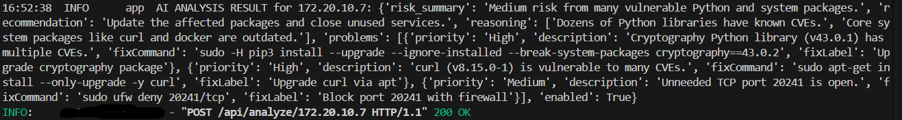

# Backend

Two FastAPI servers that together handle the full data pipeline: from receiving a raw BLE scan off the hardware, to SSH-collecting a machine's full inventory, to enriching it with CVE data and AI analysis, to streaming it live to Snap Spectacles.

```
SPECTER (ESP32)
    └── POST /api/bluetooth/scan  →  ssh_engine  :8001
                                          └── SSH into host, collect inventory
                                          └── POST /api/scan  →  app.py  :8000
                                                                    └── OSV CVE lookup
                                                                    └── MongoDB store
                                                                    └── WebSocket broadcast → Snap Lens
```

---

## Setup

### 1. Python environment

```bash
python -m venv venv
source venv/bin/activate        # Windows: venv\Scripts\activate
pip install -r requirements.txt
```

### 2. Environment variables

```bash
cp .env.example .env
```

Open `.env` and fill in:

| Variable | Description |
|---|---|
| `MONGO_URI` | MongoDB Atlas connection string (or `mongodb://localhost:27017`) |
| `MONGO_DB` | Database name, e.g. `underlayer` |
| `DO_AI_API_KEY` | DigitalOcean AI API key (primary AI provider) |
| `GOOGLE_API_KEY` | Google Gemini API key (fallback if DigitalOcean fails) |
| `RELAY_URL` | URL `ssh_engine` uses to reach `app.py` — default `http://localhost:8000` |
| `SSH_TIMEOUT` | SSH connection timeout in seconds — default `10` |
| `CMD_TIMEOUT` | Per-command timeout in seconds — default `15` |

### 3. Configure SSH targets

Edit `data/hosts.json`. Each entry is a machine that SPECTER might discover over Bluetooth and that you want to SSH-scan:

```json
[
  {
    "bt_name": "my-laptop",
    "bt_mac": "",
    "display_name": "Dev Laptop",
    "can_ssh": true,
    "hostname": "192.168.1.42",
    "device_type": "laptop",
    "ssh_port": 22,
    "ssh_user": "sami",
    "ssh_password": null
  }
]
```

- `bt_name` — substring matched against the Bluetooth device name SPECTER reports. Case-insensitive.
- `bt_mac` — optional exact MAC match; leave empty to rely on name matching only.
- `hostname` — IP or hostname used for SSH.
- `ssh_password` — set to `null` to use SSH key auth instead of password. Key auth is tried first regardless.
- `can_ssh` — set to `false` to skip SSH scanning for this host (useful for routers, phones, and other non-Linux devices).

The SSH commands collected on each scan are defined in `data/ssh_commands.json`. The defaults cover OS release, installed packages (APT, pip, npm), open ports, active services, Docker images and containers, databases, SUID binaries, and security updates.

---

## Running

Both servers run independently. Start them in separate terminals.

```bash
# Terminal 1 — relay server (WebSocket, CVE lookup, AI analysis, MongoDB)
uvicorn app:app --host 0.0.0.0 --port 8000

# Terminal 2 — SSH engine (BLE intake, SSH recon, forwards to relay)
uvicorn ssh_engine:app --host 0.0.0.0 --port 8001
```

Verify both are healthy:

```bash
curl http://localhost:8000/api/health
curl http://localhost:8001/api/health
```

Logs land in `logs/` (created automatically). Each SSH scan writes a full JSON report under `logs/scans/`, and each AI analysis result under `logs/reports/`.

---

## Endpoints

### `ssh_engine.py` — port 8001

Receives raw BLE scan data from SPECTER, matches devices against `hosts.json`, SSHs into matched hosts, and relays completed scans to `app.py`.

| Method | Path | Description |
|---|---|---|
| `GET` | `/` | Status, relay URL, loaded host count |
| `GET` | `/api/health` | Health check — confirms relay is reachable, shows hosts and command count |
| `POST` | `/api/bluetooth/scan` | **Called by SPECTER.** Receives `{scanner_id, devices: [{name, mac, rssi}]}`, clears previous session, sends device stubs to relay immediately, queues SSH scans in background threads |
| `POST` | `/api/debug/scan-host` | Directly SSH-scan a host by hostname without going through BLE matching — useful for development |
| `POST` | `/api/ssh/run-command` | Execute a specific command on a named host — called by `app.py` when a user approves a remediation action |

**`POST /api/bluetooth/scan` response:**
```json
{
  "status": "queued",
  "recognized": 2,
  "ssh_queued": 1,
  "devices": [
    { "name": "my-laptop", "recognized": true, "ssh_capable": true },
    { "name": "(Apple)",    "recognized": false, "ssh_capable": false }
  ]
}
```

The firmware uses `recognized` and `ssh_capable` to tag devices on the TFT results screen.

---

### `app.py` — port 8000

Stores scan results, enriches them with CVE data, runs AI analysis, and streams everything to connected Spectacles over WebSocket.

| Method | Path | Description |
|---|---|---|
| `GET` | `/` | Service status |
| `GET` | `/api/health` | Verifies MongoDB connection |
| `DELETE` | `/api/devices` | Clear all devices — called by `ssh_engine` at the start of each scan session |
| `POST` | `/api/scan` | **Called by `ssh_engine`.** Ingests a completed scan, runs OSV CVE lookup, saves to MongoDB, broadcasts `device_updated` to all WebSocket clients |
| `GET` | `/api/devices` | All devices with full scan data |
| `GET` | `/api/devices/ar` | Devices as AR-ready summaries (used by the lens on initial poll) |
| `GET` | `/api/devices/{hostname}` | Single device by hostname |
| `POST` | `/api/analyze/{hostname}` | Run AI analysis on a device — returns risk summary, prioritized problems, and ready-to-run fix commands |
| `POST` | `/api/approve-action` | Record approval or rejection of a remediation command; if approved, calls `ssh_engine` to execute it over SSH |
| `POST` | `/api/learn` | Explain a topic in plain language (e.g. "what is SQL injection") |
| `GET` | `/api/scanner/register` | SPECTER registers its local IP on WiFi connect |
| `WS` | `/ws/devices` | WebSocket stream — sends `initial_devices` on connect, then `device_updated` after each scan |

---

## What Gets Collected Over SSH

For each matched host, `ssh_engine` runs a sequence of commands and parses the results into a structured document. The full command list is in `data/ssh_commands.json`. Fields collected include:

- **OS:** distribution, version, kernel, architecture
- **Hardware:** CPU model, memory
- **Users:** local user accounts
- **Packages:** APT packages, pip packages, npm globals — each with name and version
- **Ports:** open TCP ports with associated process names
- **Services:** active systemd services
- **Docker:** running containers and images (with tag — `latest` tags are flagged)
- **Databases:** detected MySQL, PostgreSQL, Redis, MongoDB, Elasticsearch
- **SUID binaries:** files with setuid bit set
- **Security updates:** packages with pending security patches (via `apt list --upgradable`)
- **Cloud provider:** detected via AWS/GCP/Azure metadata endpoint probes
- **Environment:** detected web servers, Kubernetes, CI runners

---

## CVE Enrichment

After each scan, `app.py` queries the [OSV vulnerability database](https://osv.dev/) in async batches — up to 100 packages per request. Results are cached in memory (up to 2000 entries) to avoid redundant API calls across scans.

CVEs are grouped by package so the AR lens shows one card per vulnerable package rather than one card per CVE ID. GHSA and PYSEC IDs that reference the same underlying CVE are deduplicated. Severity maps to `critical`, `high`, `medium`, or `low`. If OSV returns a worse severity than the heuristic threat level assigned during scan, the device's threat level is escalated.

---

## AI Analysis

`POST /api/analyze/{hostname}` sends the device's full scan document, AR summary, and vulnerability matches to DigitalOcean AI (model: `openai-gpt-oss-120b`) with a structured prompt. If that call fails, it falls back to Google Gemini 2.5 Flash.

The response is a JSON object:
```json
{
  "risk_summary": "Medium risk from many vulnerable Python and system packages.",
  "recommendation": "Update the affected packages and close unused services.",
  "reasoning": ["Dozens of Python libraries have known CVEs.", "..."],
  "problems": [
    {
      "priority": "High",
      "description": "Cryptography Python library (v43.0.1) has multiple CVEs.",
      "fixCommand": "sudo -H pip3 install --upgrade --ignore-installed --break-system-packages cryptography==43.0.2",
      "fixLabel": "Upgrade cryptography package"
    }
  ]
}
```



Fix commands are OS-aware: pip packages get the correct `pip3 install` flags for system-managed Python, APT packages use `apt-get install --only-upgrade`, and npm packages use `npm install -g`.

---

## MongoDB Collections

| Collection | Contents |
|---|---|
| `devices` | Latest scan summary per device (upserted on each scan) |
| `device_scans` | Full historical scan documents |
| `actions` | Remediation actions with approval status and SSH output |

---

## Development Tips

**Test a scan without hardware:**
```bash
curl -X POST http://localhost:8001/api/bluetooth/scan \
  -H "Content-Type: application/json" \
  -d '{"scanner_id": "dev", "devices": [{"name": "my-laptop", "mac": "AA:BB:CC:DD:EE:FF", "rssi": -55}]}'
```

**Directly scan a host by IP:**
```bash
curl -X POST http://localhost:8001/api/debug/scan-host \
  -H "Content-Type: application/json" \
  -d '{"hostname": "192.168.1.42"}'
```

**Trigger AI analysis:**
```bash
curl -X POST http://localhost:8000/api/analyze/192.168.1.42
```

**Watch WebSocket events:**
```bash
# requires wscat: npm install -g wscat
wscat -c ws://localhost:8000/ws/devices
```
