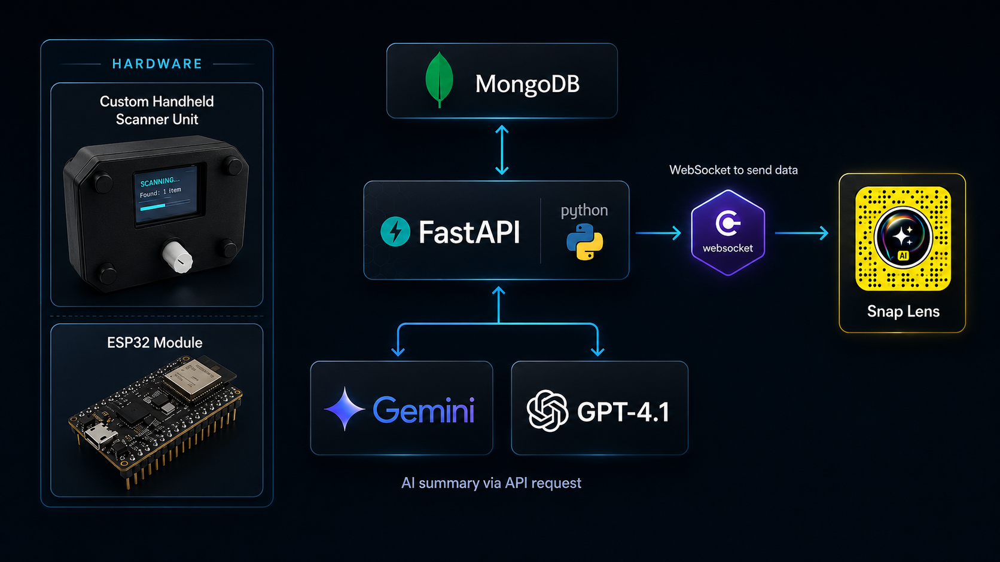

# The Underlayer

> **Make the invisible network visible.**

[](https://youtu.be/re4Crve5JkI)
&nbsp;&nbsp;
[](https://www.realityhackatmit.com/)
&nbsp;&nbsp;
[](https://www.spectacles.com/)

---

Cybersecurity is brutally hard to learn. Packets, ports, firmware versions, and CVEs have no visible form. They live in terminal output and documentation, stripped of any spatial or physical context. The Underlayer gives them one. It is a spatial learning experience for Snap Spectacles that scans the real network around you and renders it holographically: every device becomes a 3D object you can place and anchor in the real world, with an AI tutor ready to explain in plain language what each vulnerability means and what a fix actually does. The same system that teaches a student why port 27017 should not be public also helps a security engineer sweep a room before a pen test.

Built at **MIT Reality Hack at AWE Conference 2026** for the Spatial AI Learning and Education challenge.

---


---

## The Experience

### Real-Time Device Discovery

As SPECTER (the handheld BLE scanner) finds devices, they stream into the headset live. Cards appear and update as SSH scans complete in the background, so you see something immediately rather than waiting for the full sweep.


### Spatial Device Cards

When you open a device, it expands into a triple monitor display floating in AR. The left screen shows network diagnostics and open ports, the center screen shows the full vulnerability breakdown, and the right screen shows the threat analysis. All three update live as SSH scans and CVE lookups complete.


### Plain-Language Education

Tap any port or section in the triple monitor view and get a plain-language explanation of what it is and why it matters. The lens is built around the assumption that the user is a learner, not a sysadmin who already knows what MongoDB port 27017 implies.


### The Threat Indicator

Devices first appear as a floating 3D model positioned in the space around you. You can grab and place it directly above the physical machine it represents, grounding the digital data in the real world. Tap it at any time to open the triple monitor view.


### AI-Powered Analysis

Tap ANALYZE on any device and the backend sends the full scan inventory to an AI model (DigitalOcean GPT-4.1, with Gemini 2.5 Flash as fallback). The panel fills with a risk summary, prioritized problems, and specific fix commands. The AI is tuned to explain things clearly, whether the person reading is a student or a practitioner.


### One-Tap Remediation

When the AI recommends a fix, a prompt appears in the headset: approve or reject. Approval sends the command to the backend, which executes it over SSH and streams the output back. Nothing runs without explicit consent.


---

## System Architecture



The system has four layers that work in sequence:

1. **SPECTER** runs a 3-second Bluetooth Low Energy sweep and POSTs the raw device list to `ssh_engine`.
2. **ssh_engine** matches BLE names and MACs against a known-hosts file, sends device stubs to the relay immediately so the headset shows something right away, then SSH-connects to matched hosts in background threads and collects a full inventory (OS, packages, ports, services, Docker images, SUID binaries, security updates).
3. **app.py (relay)** receives each completed scan, queries the OSV vulnerability database for every installed package, calls the AI for risk analysis on demand, persists everything in MongoDB, and streams updates to connected Spectacles over WebSocket.
4. **The Snap Lens** connects via WebSocket on startup and renders each `device_updated` event as a new or updated holographic card.

| Component | Technology | Role |
|---|---|---|
| SPECTER (hardware) | ESP32, TFT ST7789, Modulino Knob | BLE sweep, WiFi relay, tactile UI |
| SSH Engine | Python / FastAPI on port 8001 | BLE intake, SSH recon, forwards to relay |
| Relay Server | Python / FastAPI on port 8000 | CVE lookup, AI analysis, MongoDB, WebSocket |
| AR Lens | Lens Studio / TypeScript | Holographic UI on Snap Spectacles |
| Database | MongoDB Atlas | Scan history, device state, action log |
| AI | DigitalOcean AI (GPT-4.1) / Gemini 2.5 Flash | Risk summaries, fix commands, explanations |

---

## Hardware: SPECTER

SPECTER is a custom handheld scanner. An ESP32 drives a 240x320 TFT display and reads a Modulino rotary knob over I2C. The whole unit fits in one hand, and can also be strapped to a reflective vest for hands-free field use.


On boot, SPECTER connects to WiFi and registers its local IP with the backend. The TFT walks through a simple setup flow: choose target device categories (all, cameras, phones, IoT sensors, etc.), set a range threshold in meters, then press the knob to scan. A 3-second BLE sweep finds up to 40 devices, identifies manufacturers from Bluetooth company IDs (Apple, Microsoft, Google), and POSTs the full list to `ssh_engine`. The display shows how many devices were recognized and how many SSH scans were queued.


---

## Getting Everything Running

All three components (backend, SPECTER, Spectacles) need to reach each other over the network. The simplest setup puts everything on the same WiFi. For demos where the Spectacles are on a different network segment, a cloudflared tunnel exposes the relay server publicly.

### Prerequisites

| Requirement | Notes |
|---|---|
| Python 3.11+ | For the two backend servers |
| MongoDB Atlas | Or a local `mongod` instance |
| Arduino IDE 2.x | With the ESP32 board package (`esp32` by Espressif) |
| Lens Studio 5.x | To open and push the Snap lens |
| Snap Spectacles (dev kit) | Or use the Lens Studio simulator for testing |
| DigitalOcean AI API key | Or a Google Gemini API key as fallback |

---

### Network Topology

**Same-network setup (recommended for demos):**

```
[WiFi Router / Hotspot]
    ├── Laptop running backend   ← fixed LAN IP strongly recommended
    ├── SPECTER (ESP32)          ← connects to WiFi, POSTs to ssh_engine :8001
    └── Snap Spectacles          ← WebSocket to relay :8000
```

Update `BACKEND_HOST` in `Firmware/Firmware.ino` to your laptop's LAN IP. SPECTER only needs to reach `ssh_engine` on port 8001 — it never calls the relay directly.

**Cross-network setup (tunnel):**

If the Spectacles cannot reach the backend on the same LAN, use [cloudflared](https://developers.cloudflare.com/cloudflare-one/connections/connect-networks/downloads/) to expose the relay:

```bash
# Install cloudflared (macOS example)
brew install cloudflared

# Expose the relay server on port 8000
cloudflared tunnel --url http://localhost:8000

# cloudflared prints a public URL, e.g.:
#   https://gentle-thunder-4521.trycloudflare.com

# Use that URL in the Snap lens — change ws:// to wss://
# In Frontend/snap-spectacles/Assets/Scripts/DeviceListPanel.ts:
#   const WS_URL = "wss://gentle-thunder-4521.trycloudflare.com/ws/devices";
```

SPECTER still connects over LAN to `ssh_engine` (port 8001). Only the relay (port 8000) needs to be publicly reachable for the Spectacles.

---

### Step 1 — Backend

Full instructions: [Backend/README.md](Backend/README.md)

```bash
cd Backend

python -m venv venv
source venv/bin/activate        # Windows: venv\Scripts\activate
pip install -r requirements.txt

cp .env.example .env            # fill in MONGO_URI, DO_AI_API_KEY, GOOGLE_API_KEY
```

Configure SSH targets in `Backend/data/hosts.json` (one entry per machine you want to scan):

```json
[
  {
    "bt_name": "my-laptop",
    "hostname": "192.168.1.42",
    "device_type": "laptop",
    "ssh_port": 22,
    "ssh_user": "sami",
    "ssh_password": null,
    "can_ssh": true
  }
]
```

Run both servers (two terminals):

```bash
# Terminal 1 — relay server
uvicorn app:app --host 0.0.0.0 --port 8000

# Terminal 2 — SSH engine
uvicorn ssh_engine:app --host 0.0.0.0 --port 8001
```

Verify both are up:

```bash
curl http://localhost:8000/api/health
curl http://localhost:8001/api/health
```

---

### Step 2 — Firmware (SPECTER)

Full instructions: [Firmware/README.md](Firmware/README.md)

1. Open `Firmware/Firmware.ino` in Arduino IDE 2.x.
2. Set credentials at the top of the file:
   ```cpp
   const char* WIFI_SSID    = "your-ssid";
   const char* WIFI_PASS    = "your-password";
   const char* BACKEND_HOST = "192.168.1.100"; // your laptop's LAN IP
   ```
3. Select board: **ESP32 Dev Module**.
4. Set partition scheme: `Tools > Partition Scheme > Huge APP (3MB No OTA)`.
5. Flash. The TFT will show the WiFi connection screen on boot.

---

### Step 3 — Snap Lens

Full instructions: [Frontend/README.md](Frontend/README.md)

1. Open `Frontend/snap-spectacles/snap.esproj` in Lens Studio 5.x.
2. In `Assets/Scripts/DeviceListPanel.ts`, set `WS_URL` to your backend address:
   ```typescript
   const WS_URL = "ws://192.168.1.100:8000/ws/devices";
   // or for cloudflared:
   // const WS_URL = "wss://gentle-thunder-4521.trycloudflare.com/ws/devices";
   ```
3. Push to Spectacles via Lens Studio, or run in the built-in simulator.

The lens connects to the relay over WebSocket on startup. Once connected, it receives `initial_devices` (any devices already in the database) and then `device_updated` events as scans complete.

---

## Repository Layout

```
the_underlayer/
├── Backend/
│   ├── app.py                  # Relay server — WebSocket, CVE, AI, MongoDB
│   ├── ssh_engine.py           # SSH engine — BLE intake, SSH recon
│   ├── data/
│   │   ├── hosts.json          # SSH targets (bt_name, hostname, credentials)
│   │   └── ssh_commands.json   # Commands collected on each SSH scan
│   ├── .env.example
│   ├── requirements.txt
│   └── README.md
├── Firmware/
│   ├── Firmware.ino            # ESP32 sketch — BLE scanner, TFT UI, WiFi POST
│   └── README.md
├── Frontend/
│   ├── snap-spectacles/        # Lens Studio project
│   │   └── Assets/Scripts/     # TypeScript source (DeviceListPanel, DeviceDetailPanel, ...)
│   └── README.md
├── Images/                     # Screenshots and diagrams
└── README.md
```

---

## Built At

**MIT Reality Hack at AWE Conference 2026** — Spatial AI Learning and Education challenge.

The Underlayer treats the invisible as something that can be seen, and treats the learner as someone who deserves a real explanation in the real word.
