# The Underlayer

**A spatial cybersecurity lens for Snap Spectacles.** The Underlayer turns nearby network devices into inspectable holograms: scan a room, place each device in space, open a triple-monitor diagnostic panel, ask what a port or risk means, and approve remediations only when the human says yes.

Cybersecurity usually hides inside terminal output, package lists, and CVE tables. The Underlayer makes that layer visible. It is built for learning, demos, and controlled lab assessment: a student can understand why an exposed database port matters, while a security practitioner can quickly sweep a room and explain findings without leaving the headset.

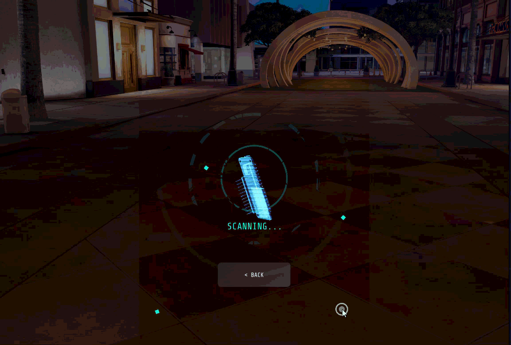

## What Stands Out

- **Real spatial workflow:** scan, discover, place, analyze, learn, approve, and re-scan.
- **Optional live scanner:** SPECTER, a custom ESP32 handheld unit, can collect BLE and Wi-Fi signals and hand the scan to the backend.
- **One backend process:** FastAPI now serves scanner intake, SSH inspection, OSV vulnerability enrichment, analysis, remediation approval, and the Lens API from one port.
- **Minimal cloud dependency:** Google Gemini is optional. Without an API key, the backend still produces deterministic offline analysis and local port/metric explanations.
- **Demo Mode for judging:** the Lens can run a polished no-hardware flow in Lens Studio, while still using the backend for notebook explanations when available.
- **Human-gated fixes:** suggested commands are shown first; SSH execution only happens after explicit approval.

## Experience Loop

1. **Scan:** tap `SCAN` in the Lens or trigger the SPECTER hardware.
2. **Discover:** recognized devices appear as holographic models and indicators.
3. **Place:** pin devices into the physical scene so the network becomes spatial.
4. **Analyze:** open the triple-monitor panel to see ports, CVEs, system context, and risk.
5. **Learn:** tap a port or threat section to open the notebook explanation.
6. **Approve or reject:** review generated fix commands before anything runs over SSH.
7. **Repeat:** re-scan after remediation to show progress.

## Lens Walkthrough

### Discover Devices

As devices are discovered, the Lens presents them as spatial cards and holographic objects instead of flat scan output.

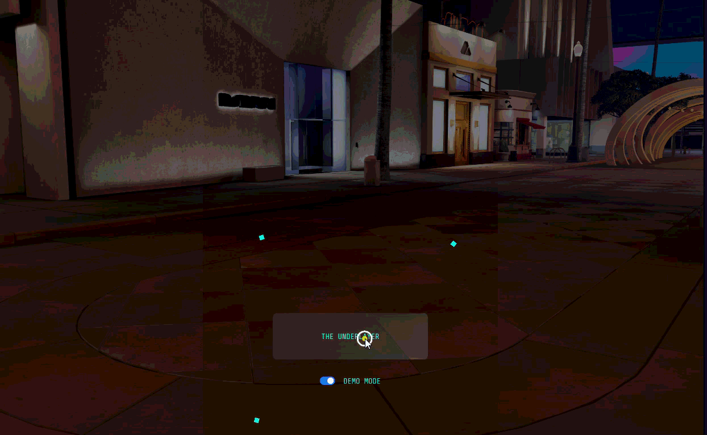

### Place Devices In Space

Each device can be anchored near the physical object or area it represents, turning the room itself into the interface.

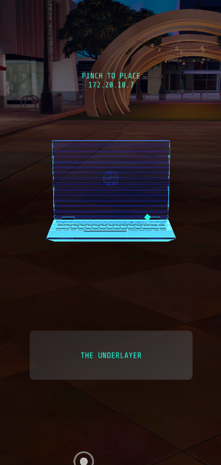
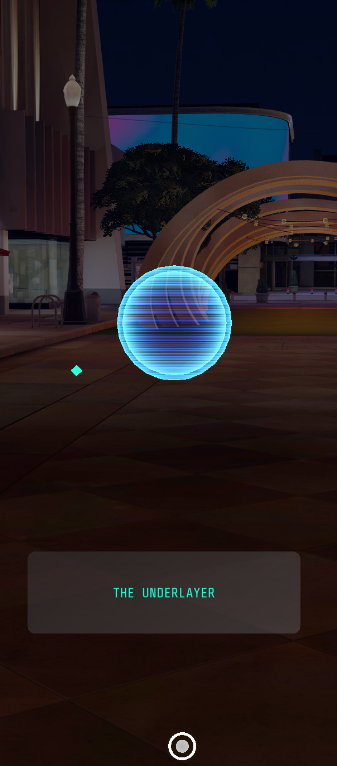

### Analyze Risk

Opening a device reveals a triple-monitor diagnostic surface with network details, vulnerability context, and action items.

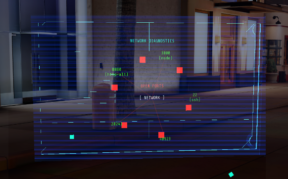
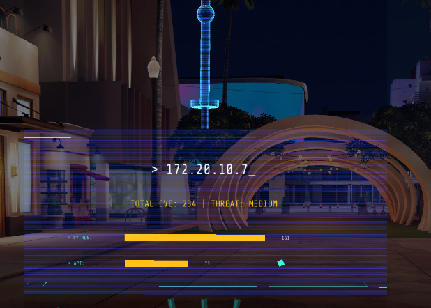
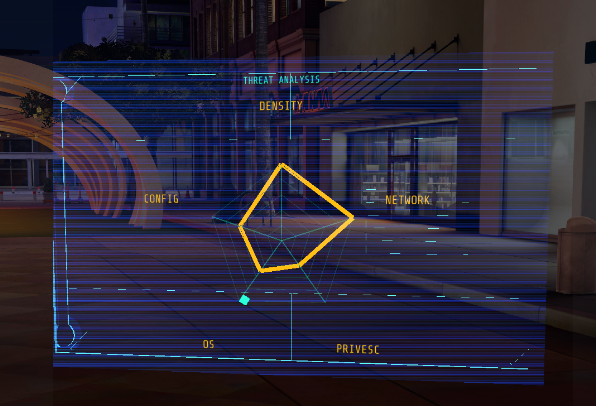
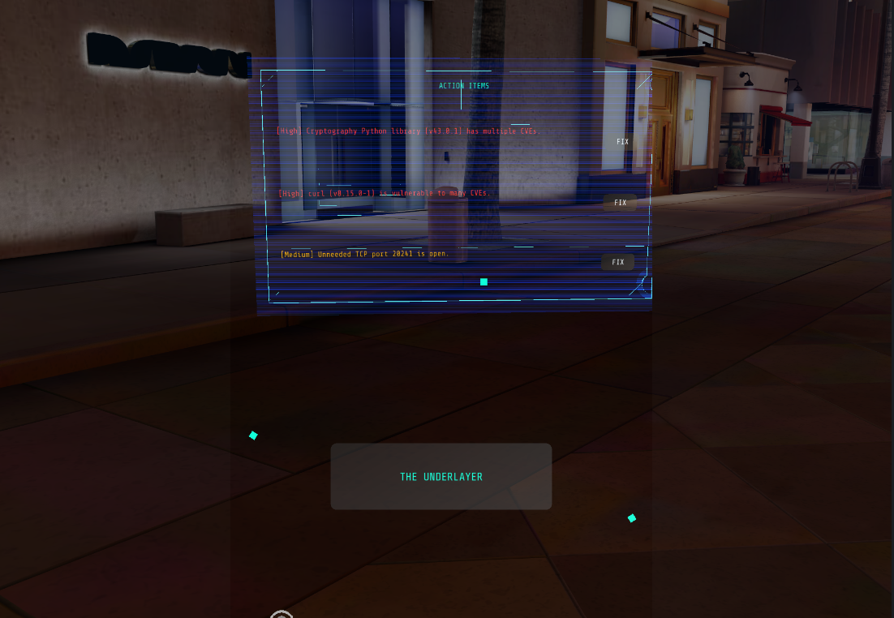

### Learn What It Means

Tapping a port or threat area opens a notebook-style explanation. With Gemini configured, explanations can be personalized; without a key, the backend uses its offline knowledge base for common ports and metrics.

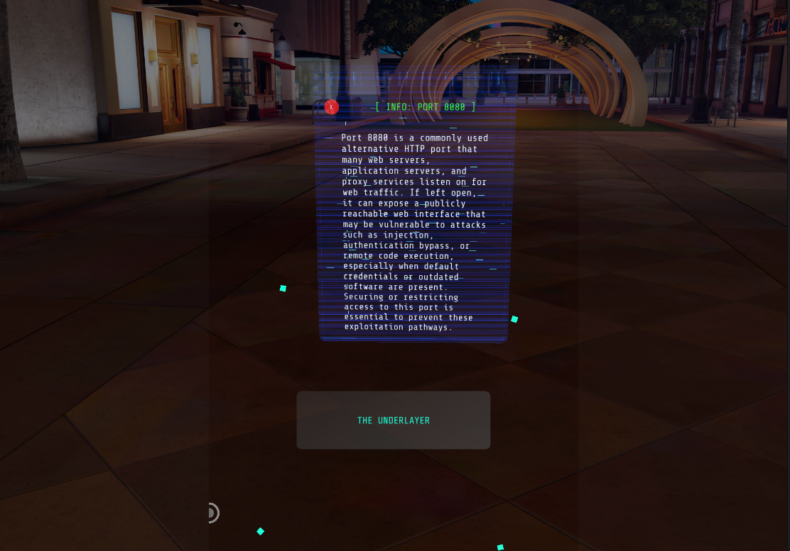

### Approve Or Reject Fixes

The Lens can show a concrete remediation command, but nothing runs automatically. The user must approve or reject the action.

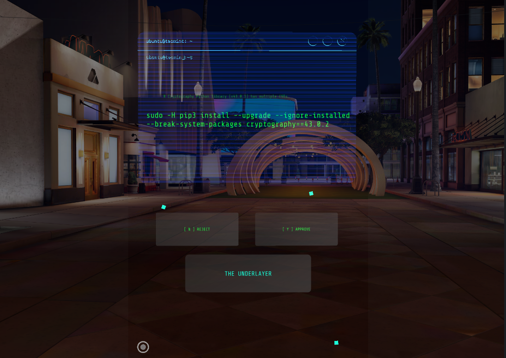

## Architecture

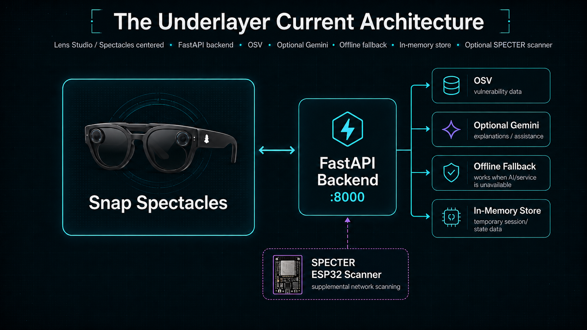

```text
Lens Studio / Snap Spectacles
  - Demo Mode or live devices
  - 3D placement
  - triple-monitor diagnostics
  - notebook explanations
  - approve/reject remediation
        |
        | HTTP polling and REST actions
        v
Backend/FastAPI on :8000
  - in-memory device store
  - OSV vulnerability lookup
  - Gemini analysis when GOOGLE_API_KEY is set
  - offline analyzer and offline knowledge base otherwise
  - SSH inventory collection for known lab devices
        ^
        | POST /api/bluetooth/scan
        |
Optional SPECTER ESP32
  - BLE scan
  - Wi-Fi scan
  - local /api/scan trigger
```

The backend also exposes `/ws/devices` for clients that want a WebSocket stream. The current Lens uses the `websocketUrl` Inspector field as the single configured backend URL and derives the HTTP base from it.

## Optional Hardware: SPECTER

The Lens does not require SPECTER for a polished walkthrough: Demo Mode is built in, and the backend can also be tested directly. SPECTER adds a live room-scanning path for demos where the hardware is available.

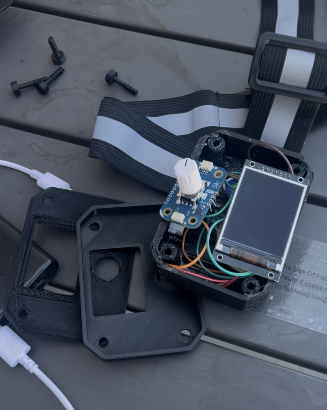
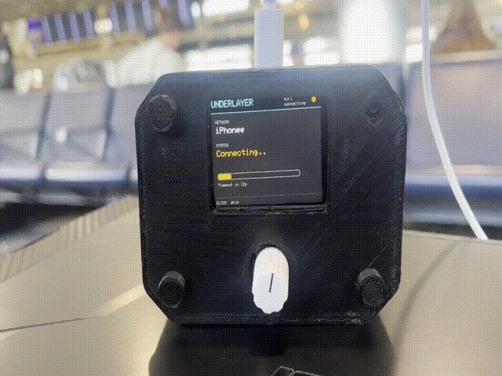

## Quick Start

### 1. Clone With Git LFS

The Lens project ships binary assets through Git LFS. A normal ZIP download can miss required model/audio files.

```bash
git lfs install
git clone <your-repo-url>
cd the_underlayer
git lfs pull
```

### 2. Run The Backend

```bash
cd Backend
python run.py setup
python run.py run
```

Health check:

```bash
python run.py health
```

Optional AI configuration:

```bash
# Backend/.env
GOOGLE_API_KEY=your_key_here
GEMINI_MODEL=gemini-2.5-flash-lite
```

No key is required for the core demo. `/api/analyze/{hostname}` falls back to the offline analyzer, and `/api/learn` falls back to the built-in knowledge base.

### 3. Open The Lens

1. Open `Frontend/snap-spectacles/snap-spectacles.esproj` in Lens Studio.
2. Select the `DeviceListPanel` object.
3. In the Inspector, set `Websocket Url` to your backend:

```text
ws://<your-laptop-lan-ip>:8000/ws/devices
```

Use your LAN IP, not `localhost`, when testing on Spectacles or another device. The Lens derives `http://<ip>:8000` from the same field for scan, analyze, learn, and approve calls.

### 4. Choose A Demo Path

**No hardware path:** keep `DEMO MODE` enabled in the Lens. You can show device cards, placement, analysis, action buttons, and notebook learning immediately. If the backend is running, notebook explanations use `/api/learn`; if Gemini is absent, the offline knowledge base answers common ports and metrics.

**Live SPECTER path:** flash the ESP32 firmware, run the backend, let SPECTER register its IP, then tap `SCAN` in the Lens. The backend calls SPECTER's local `/api/scan`; SPECTER scans and posts results back to `/api/bluetooth/scan`.

**Backend-only development path:** post directly to `/api/debug/scan-host` with SSH credentials and `forward_to_relay=true` to test the full backend/Lens pipeline without SPECTER.

## Repository Map

```text
the_underlayer/
  Backend/
    app/                  FastAPI app, routers, AI/offline analysis, OSV, SSH, store
    data/                 local host matching and SSH command definitions
    run.py                cross-platform setup/run/health helper
  Frontend/
    snap-spectacles/      Lens Studio project used by Spectacles
    Spectacles-Sample/    Snap reference projects used for best-practice comparisons
  Firmware/
    Firmware.ino          SPECTER ESP32 scanner firmware
  Images/                 project screenshots and hardware media
  3D Model/               enclosure CAD assets
```

## Security Notes

The Underlayer is designed for a controlled lab/demo network. SSH remediation uses local credentials from `Backend/data/hosts.json`, and unknown SSH host keys are accepted for demo convenience. Do not point this at networks or machines you do not own or have explicit permission to test. Before publishing, keep real credentials out of `hosts.json` and use placeholder values or a local ignored file.

## More Documentation

- [Backend README](Backend/README.md) - setup, environment variables, endpoints, and security limitations.
- [Frontend README](Frontend/README.md) - Lens Studio setup, Inspector fields, Demo Mode, and key scripts.
- [Firmware README](Firmware/README.md) - SPECTER hardware setup and scan flow.
